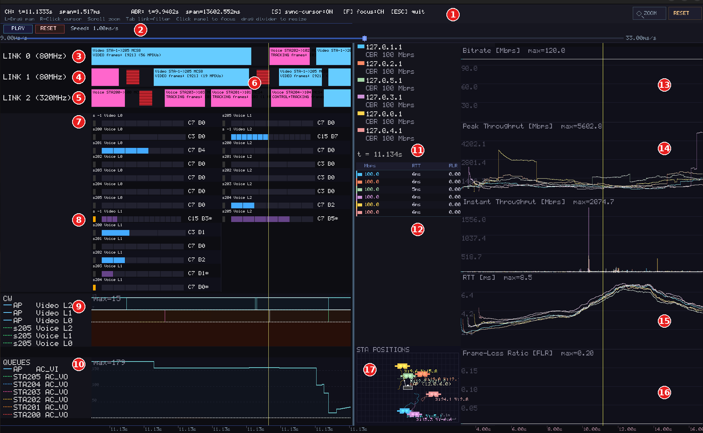

# SiESTA-VR: Simulation Environment for Streaming Applications in Virtual Reality

[](https://opensource.org/licenses/MIT)
[](https://www.rust-lang.org/)
[](https://en.wikipedia.org/wiki/IEEE_802.11be)

**SiESTA-VR** is a discrete-event simulator of Cloud VR streaming over Wi-Fi. It reproduces the full bidirectional pipeline of a real system like ALVR — video encoding, MAC-layer transmission, ABR bitrate adaptation, decoding — down to individual MPDUs on an **IEEE 802.11be (Wi-Fi 7)** channel, so you can study how network conditions (contention, MLO, mobility, background traffic, packet loss) affect VR quality of experience without needing physical hardware or a real wireless testbed.

**Why it's useful:** Cloud VR has tight latency/throughput requirements that are expensive and slow to test at scale on real networks — you'd need multiple headsets, APs, and controlled interference to sweep even a handful of scenarios. SiESTA-VR runs those sweeps in software, in parallel, on a laptop or an HPC cluster, while still modeling the physical and MAC layer in enough detail (EDCA contention, A-MPDU aggregation, MLO link scheduling) that the results are representative of real Wi-Fi behavior.

**What it generates:** every run produces per-user QoE telemetry (frame delay, RTT, jitter, frame/shard loss, throughput), MAC-layer traces (per-MPDU transmission, collisions, contention windows), ABR bitrate-decision logs, and head-mobility traces — as CSV or Parquet — plus, optionally, a live per-user GUI of the decoded video and a scrubbable post-simulation visualizer of channel activity and ABR behavior. See [Simulation Outputs](#simulation-outputs) below for the full breakdown. 

Future extensions to this framework will integrate python RL libraries (SB3, RLlib), in order to train decision-making agents to optimize network parameters, application parameters, or both.   
The simulation engine is built on a fork of the asynchronous [**NeXosim**](https://github.com/asynchronics/nexosim) library in Rust, adapted for networking simulation.

---

## 🚀 Key Features

* **High-Fidelity VR Modeling:** Mimics the bidirectional traffic and logic of real Cloud VR sessions (e.g., ALVR), moving beyond generic traffic generators.
* **Native Wi-Fi 7 Support:** Incorporates core Wi-Fi features such as Multi-Link Operation (MLO) and Enhanced Distributed Channel Access (EDCA), with architecture in place for future OFDMA integration.
* **Advanced Codec Integration:** Supports real-time 4K resolution video encoding (60/90/120 FPS) utilizing HEVC and AV1 codecs, with a per-user GUI showing the decoded video and metrics. 
* **Lightweight Mode:** Execute fast simulations using pre-recorded CSV logs of video frame sizes mapped to specific codecs (HEVC/AV1), framerates (60/90/120 FPS), and CBR bitrates (5-100 Mbps).
* **ABR Benchmarking:** Provides a comprehensive suite of Adaptive Bitrate (ABR) algorithms to evaluate scalability and congestion impact on application-level QoS metrics.
* **HPC Parallel Execution Engine:** Tested on the [UPF HPC cluster](https://guiesbibtic.upf.edu/recerca/hpc/home) and a high-end laptop computer. Supports [GNU Parallel](https://www.gnu.org/software/parallel/) for rapid, large-scale data generation across multiple network scenarios. 

---

## ⚙️ Architecture and Pipeline

The simulator is designed to handle multiple VR sessions concurrently, with a synchronized simulation time across all devices in the network. It supports static user positions and dynamic mobility (via random walk) with configurable distances to the Access Point (AP). The VR streaming simulated sessions follow the bidirectional pipeline illustrated below:


---

## 🛠️ Getting Started

### Prerequisites & Dependencies

To compute VMAF metrics and handle video transcoding recorded from simulations, this simulator requires:
* **Rust Toolchain**: (Latest stable release)
* **FFMPEG v7.1**: [Download here](https://ffmpeg.org/download.html)
* **libvmaf (Optional, for offline VMAF/SSIM evaluation)**: [GitHub Repository](https://github.com/Netflix/vmaf/tree/master/libvmaf)

### Asset Configuration

**1. Live Transcoding Mode (Real Video pipeline):**
Ensure your video source files are located in the `video_samples_vmaf` folder. The simulation expects interpolated 4K videos formatted as `<video_filename>_<FPS>fps.mp4` (e.g., interpolated using FFmpeg `minterpolate`).
> *Note: Sample 4K/60FPS videos can be obtained from the [Blender Open Data platform](http://bbb3d.renderfarming.net/download.html). Running a specific FPS in the simulation requires a source video matching that framerate.*

**2. Lightweight Mode (Recommended, based on CSV logs):**
For faster execution without real-time transcoding, set `USE_FFMPEG_DEMO = False`. The simulator will read frame sizes from the `csv_framesizes` directory instead, using the naming convention `<codec>_<video_filename>_<FPS>fps.csv`.
> *Tip: Custom CSV logs can be generated from arbitrary video samples across specific FPS and bitrates by running the script in `examples/p_encode2csv.rs`:* `cargo run --release --example p_encode2csv`

---

## 📊 Simulation Outputs

When `USE_FFMPEG_DEMO = True`, every simulated VR client generates a window with a Graphical User Interface (GUI) showing the decoded video and simulation parameters, user trajectory and a sliding window of QoS metrics. This is exemplified in the next figure, which shows the per-user GUIs of 3 CBR users streaming while performing a random walk:
<p align="center">
  
</p>


Upon execution of each simulated scenario the framework generates a uniquely named directory based on the specific input arguments to the simulation. Specifically, the lengthy folder scenario name creates a subfolder inside the `results_path_name` destination path, based on the following string: 
```rust
   let name_folder = format!(
        "sim_T{:.0}_D{:.1}_Br{:.1}Mbps_FPS{:.0}_Codec{codec_input_arg}_GoP{:.0}_IR{:.0}_Foveate{:.0}_VBVframe{:.0}_macPL{:.1}_aggAMPDU={:.0}_NXR{:.0}_NBG{:.0}_BGLambda{:.0}_UL{:.0}_{suffix}_{video_filename}_Nclose{:.0}_dclose{:.1}_S{:.0}_ABR{:.0}_{mlo_channel_config}_EDCAbe{:.0}_RWALK{:.0}",
        stoptime, distance, initial_bitrate, fps_arg, gop_size, intra_refresh, use_foveation, vbv_per_frame, pl_prob, packs_per_ampdu, n_xr, n_bg, rate_bps_bg_in ,is_ul_bg_traffic,  n_close, distance_close, seed,abr, edca_be, test_distances_everest,
    );
```

### CSV vs. Parquet logging

Every telemetry stream in SiESTA-VR can be written either as line-delimited CSV or as batched, Snappy-compressed [Apache Parquet](https://parquet.apache.org/), independently controlled by boolean constants in [`asynchronix/examples/lib/mod.rs`](asynchronix/examples/lib/mod.rs):

| Const | Default | Produces |
| :--- | :--- | :--- |
| `NETWORK_CSV_LOGGING` | `false` | `QUEUE_stats.csv` |
| `NETWORK_PARQUET_LOGGING` | `false` | `QUEUE_stats.parquet` |
| `XR_CSV_LOGGING` | `false` | `XR_stats_{id}.csv` |
| `XR_PARQUET_LOGGING` | `true` | `XR_stats_{id}.parquet` |
| `TRACKING_CSV_LOGGING` | `false` | `TRACKING_stats_{id}.csv` |
| `TRACKING_PARQUET_LOGGING` | `true` | `TRACKING_stats_{id}.parquet` |
| `BITRATE_PARQUET_LOGGING` | `true` | `BITRATE_stats_{id}.parquet` (Parquet-only, no CSV path exists) |

Any combination can be toggled on at once (e.g. both CSV and Parquet for the same stream), or all switched off entirely for a pure benchmarking run with no I/O overhead. A few things worth knowing before flipping these:
* **Parquet is the recommended default** for large parameter sweeps: it is columnar and compressed, so multi-GB result sets stay a fraction of the size of the equivalent CSV, and it loads far faster into `pandas`/`polars`/Arrow-based pipelines downstream. All three Parquet writers run on a background thread, batching rows before each write so the simulation's hot path is never blocked on disk I/O.
* **CSV remains useful for quick inspection or piping into tools that don't speak Parquet.** The CSV writers are append-based and flush every `BATCH_SIZE_CSV_QUEUE` / `BATCH_SIZE_CSV_XR` rows (see the batch-size constants near the top of `mod.rs`).
* `NETWORK_*_LOGGING` is the highest-volume stream by far (one row per MPDU across *all* STAs) — leave both off unless you specifically need MAC-layer forensics, since it dominates output size and I/O time in multi-user, multi-node sweeps.
* The `trace_emu_effects_{id}.csv` file (see table below) is always written when emulated network effects are active — it isn't gated by any of the consts above.

Inside these result folders, the generated files capture metrics bridging the 802.11be MAC layer all the way up to the VR application layer.
For a simulation configuring $N_{XR}$ total users, telemetry is divided per-user using an identifier ranging from `0` to `N_XR - 1` (e.g., `XR_stats_0.parquet`, `XR_stats_1.parquet`).

| Generated File | Description & Core Data Columns |
| :--- | :--- |
| **`QUEUE_stats.{csv,parquet}`** | **Global MAC-Layer Metrics:** Provides an event-by-event log of *every* MPDU traversing the simulation network. Logs include `packet_id`, STA source and destination IDs (`id_src`/`id_dest`), MAC `queue_size` during the transmission of the packet, transmission time (`t_s`), MAC queuing delay (`t_q`), aggregation size (`ampdu_id`), collisions (`is_collision`), contention windows (`cw_value`), Access Category (`edca_ac`), MAC retry counters (`backoff_retry_counter`), and which interface was utilized (`link_id` — crucial for MLO evaluation). |
| **`XR_stats_{id}.{csv,parquet}`** | **Application-Level VR Metrics:** Per-frame QoS telemetry evaluated directly at the VR client. Tracks variables vital to user QoE, including: `frame_size_bytes`, `server_fps`, `ow_delay_ms` (one-way delay), `rtt_ms` (Video Frame RTT), `frame_jitter_ms`, `instant_network_throughput_bps`, `decoder_jitterbuffer_level`, `num_rebuffering_events`, and frame/shard losses (`flr_deadline`, `shardloss_deadline`). |
| **`TRACKING_stats_{id}.{csv,parquet}`** | **Uplink Mobility Tracking:** Records the kinematics of the VR headset. Includes the high-frequency polling `timestamp`, the device coordinates (`pos_x`, `pos_y`, `pos_z`), and the generation `interarrival_ms` defining the uplink tracking data rate. |
| **`BITRATE_stats_{id}.parquet`** | **ABR Decision Trace:** One row per generated video frame recording the bitrate the active ABR algorithm selected for that frame, useful for reconstructing the exact bitrate ladder trajectory of NeSt-VR/EVeREst/GCC/NADA/Oracle runs without re-deriving it from `XR_stats`. Parquet-only (no CSV logging toggle exists for this stream). |
| **`trace_emu_effects_{id}.csv`** | **Network Emulation Dynamics:** Traces the exact timing and parameters of the exogenous synthetic network effects (if any) applied to a user's connection pipeline. It tracks bandwidth limits (`bw_max_bps`), jitter variances (`jit_variance`), and forced `drop_probability`, specially useful for reproducibility when bandwidth effects are randomly spread over a simulation (e.g., when the `EMU_TEST_TYPE` setting is set to `"RANDOM"`). |  
### Debug logging outputs

The simulator has a debug feature when setting `DEBUG_PRINT_ENABLED = True`, where most components of a VR session at the lowest level produce events logging the simulation timestamp and information about the ongoing processes for each VR session, using macros for coloring the terminal output. Similar debugging features are found with `DEBUG_EDCA` and `DEBUG_MLO`, more focused on the respective mechanisms. If `SERIAL_EXECUTION=1` in the bash script, the entire output of a simulation is saved into an ANSI file named `out_log.ans`, which can be inspected for debugging purposes during or after a simulation. For speed, most debugging prints are disabled as the default. 

### Post-Simulation Channel & ABR Visualizer

Beyond the persisted CSV/Parquet files, SiESTA-VR can replay a simulation's medium activity and ABR decisions in an interactive `minifb` window once the run finishes, controlled by `VISUALIZER_QUEUES_ENABLED` in [`asynchronix/examples/lib/mod.rs`](asynchronix/examples/lib/mod.rs) (`true` by default).

While the simulation runs, the queue model emits `VizEvent`s (per-link TXOP grabs, collisions, contending STAs, MCS, aggregated A-MPDU contents down to the ALVR stream/frame IDs carried in each transmission) and the XR server/client emit `AbrEvent`s (per-frame metrics and bitrate ladder updates). Both streams are collected in memory and, right after the simulation loop ends, handed to a scrubbable timeline viewer (`postsim_visualizers.rs`) that opens automatically.
The unified window is split into a **channel view** (left) and an **ABR view** (right), sharing a common simulated-time cursor in yellow indicating the instant seen in both interactive windows. The time base of each view is independent, and can be zoomed in/out independently. 



The screenshot above is a real capture from a 6-VR-user, 3-link MLO run (`MLO80-80-320`: two 80MHz links plus one 320MHz link) with EDCA active. Link 2's 320MHz channel is four times wider than links 0/1, so its transmissions finish noticeably faster for the same amount of data.

| # | Panel | What it shows |
| :-: | :--- | :--- |
| 1 | Top HUD | Channel (`CH:`) and ABR scrub position/zoom span, key bindings. |
| 2 | Transport controls | Play/pause, reset, and the replay-speed slider (~9µs-33ms of sim-time per real second). |
| 3 | LINK 0 (80MHz) | Transmission events on this link: UL/DL direction, application stream involved, number of MPDUs aggregated, MCS. |
| 4 | LINK 1 (80MHz) | Same, for the second 80MHz link. |
| 5 | LINK 2 (320MHz) | Same, for the 320MHz link — same kind of activity, but a channel four times wider than links 0/1, so transmissions finish faster for the same amount of data. |
| 6 | Collision | Two or more contenders transmitted at once on LINK 1 and both frames were lost. |
| 7, 8 | Per-STA/AC contention rows | Per-flow contention/backoff state (AIFS + CW) feeding the transmissions above, split into left/right columns here because the panel is link-filtered. |
| 9 | CW panel | Contention window over time — the visible bump lines up with the collision at 6. |
| 10 | QUEUES panel | MAC transmit-queue depth over time — draining a backlog built up before the collision. |
| 11 | ABR legend | One entry per VR session: source IP, color, and active ABR mode. |
| 12 | Live readout table | Per-session bitrate/RTT/FLR snapshot at the current scrub time. |
| 13 | Bitrate strip | Each session's ABR-selected bitrate over time. |
| 14 | Throughput strips | Peak/Instant achieved throughput over time — the spike is the retransmission burst right after the collision. |
| 15 | RTT strip | Round-trip time per session over time, based on the Video Frame RTT (VF-RTT) metric. |
| 16 | Frame-Loss Ratio strip | Per-session frame-loss ratio over time. |
| 17 | STA POSITIONS | Top-down mini-map, AP centered, current position and trajectory of each VR STA. |

## 💻 Simulation Configuration & Execution

SiESTA-VR utilizes the `p_xrun.sh` bash script to manage execution. The script is heavily optimized for **SLURM-based High-Performance Computing (HPC)** environments but supports local execution (with minor warnings). It iterates over arrays of variables to automatically generate and simulate massive parameter sweep combinations, which can be serially executed or run in parallel over multiple nodes.

Before running, opening `p_xrun.sh` is recommended for adjusting the arrays and variables to design the experiment space. For a description of the main simulation parameters:

### 1. Wi-Fi & Network Topology Settings
| Variable | Description |
| :--- | :--- |
| `MLO_CONFIGS` | Regex-based Wi-Fi 7 mode selection (e.g., `"SLO80"` for Single Link 80MHz, `"MLO80-80"` for MLO with two 80MHz channels, `"MLO80-320"`, etc.). |
| `MLO_policies` | Cross-link scheduling policy: `0` (PrimaryFirst), `1` (Opportunistic), `2` (LyapunovBackpressure). Unused when const `STR_PLUS_MODE_MLO` is set to true. | 
| `EDCA_BE_MODE` | Set to `1` to force all traffic into the Best Effort (BE) Access Category, or `0` for default AC mapping. |
| `packs_per_ampdu` | Target number of MPDUs per aggregated A-MPDU transmission (e.g., `64`). |
| `distance_list` | Base distance (in meters) of users to the Access Point (e.g., `2.5`). |
| `num_close_users` / `distance_close_users` | Used to create heterogeneous spatial layouts by setting a specific number of users closer to the AP. |
| `RANDOMWALK_TEST` | If `1`, randomizes all VR user positions and applies a random walk mobility model (2 m/s in a 11.5m radius). |
| `PL` | MAC Packet Error Rate, applies (0-1) chance for each MPDU traveling in an A-MPDU to not be received and require retransmission. |
| `RANDOM_SEEDS` | List that determines the number of random seeds applied per scenario. |

### 2. VR Streaming & Video Parameters
| Variable | Description |
| :--- | :--- |
| `N_XR` | Number of concurrent VR user sessions in the simulation (e.g., `1` through `10`). |
| `CODEC_CHOICES` | Video codec selection: `"HEVC"`, `"AV1"`. |
| `video_samples` | The specific video sequence to use (e.g., `"snow_short"`). |
| `initial_bitrate_mbps` | Starting Constant Bit Rate (CBR) or initial target for ABR algorithms. |
| `fps_list` | Video frame rate (e.g., `60.0`, `90.0`, `120.0`). |
| `GoP_sizes` | Group of Pictures size (must be less than `T_ABR * FPS`). |
| `intrarefresh_choice` | Enables intra-refresh (`1`) for error resilience when `USE_FFMPEG_DEMO` is active. Overrides `GoP_sizes` if set to true. |
| `USE_FOVEATION` | Enables foveated encoding (`1`) when `USE_FFMPEG_DEMO` is active. |
| `VBV_PERFRAME` | VBV (rate control buffer) granularity: `1` enforces the bitrate cap per-frame, `0` per-second. |
| `NO_UL_TRACKING_MODE` | Set to `1` to disable uplink tracking-packet generation entirely, reducing UL channel churn (less realistic, useful for isolating 802.11 MAC behavior). Independent of `TRACKING_CSV_LOGGING`/`TRACKING_PARQUET_LOGGING` — with tracking generation disabled, those writers still run but simply have no rows to log. |
| `DETERMINISTIC_FIBONACCI_VIDEO` | Set to `1` to derive frame sizes from a deterministic Fibonacci-based sequence instead of the codec/CSV-driven trace, for reproducible synthetic runs decoupled from any input video. |
| `DELAY_MAC_ENABLED_MODE` | Set to `1` to insert a `BANDWIDTH_EMU_LINK` (1 Gbps, see `xr_entry/mod.rs`) emulated link between the APP and MAC layers, adding realistic delay that affects A-MPDU aggregation and channel efficiency. |

### 3. Adaptive Bitrate (ABR) Configuration
| Variable | Description |
| :--- | :--- |
| `ABR_ENABLED` | Selects the ABR algorithm: `0` (CBR), `1` (NeSt-VR), `2` (EveREst), `4` (GCC), `5` (NADA), `8` (Emulated Bandwidth Oracle), `9` (ALVR Adaptive). |
| `T_ABR` | Interval (in seconds) between ABR updates or RL step actions (e.g., `1.0`). |
| `nest_profiles` | Specific configuration tuning profiles for the NeSt-VR algorithm. |

### 4. Background Traffic Settings
| Variable | Description |
| :--- | :--- |
| `N_BGs` | Number of active Background (BG) Stations sharing the medium with Poisson distributed traffic. |
| `rates_bps_BGtraffic` | The traffic rate (bps) generated by Poisson background STAs (e.g., `5000` to `500000`). |
| `IS_UL_BG` | Direction of BG traffic: `0` (Downlink), `1` (Uplink), `2` (Bidirectional). |
| `mean_length_BG` | Average packet payload length for background traffic (in bits). |
 
### 5. Emulated Network Effects
| Variable | Description |
| :--- | :--- |
| `EMU_TEST_TYPE` | Injects synthetic network anomalies: `"BW"` (Bandwidth limit), `"JI"` (Jitter), `"PL"` (Packet Loss), `"RANDOM"` (Randomly placed emulated periods), `"MARKOV"` (Markov Chain based Emulated BW patterns) or `"STD"` (Standard/None). |

### Running the Simulator
A feature of how the repository has been structured ( Renaming the original asynchronix `examples` to `orig_examples` and using the `examples` folder just for SiESTA-VR), the simulator can technically be called via `cargo run --release --example XR_sim [<arg0><arg1>...]` but due to the amount of configuration parameters, it is more encouraged to opt for execution from a bash script that iterates over input argument combinations.  
**On any computer with the required dependencies:**
Adjust `NUMBER_OF_JOBS` and `SERIAL_EXECUTION`, and run the bash script with: 
```bash
./p_xrun.sh
```
**On an HPC Cluster (SLURM):**
Submit the job array using `sbatch`. The script utilizes weighted interleaving to balance heavy tasks (such as MLO simulations with many VR users) across the selected computing nodes and number of CPUs per node. Simulations involving 1-6 users are relatively fast, with the more complex scenarios the number of simulated events increases exponentially.

```bash
sbatch p_xrun.sh
```
Alternatively, there is an example on calling instances of the simulator from a python script in `asynchronix/examples/python_xrsim.py`, e.g.:
```bash
python asynchronix/examples/python_xrsim.py
```

---

## 🎞️🔍 VMAF evaluation: 

After a simulation is finished, the frame IDs logged for each user on a simulated scenario folder can be passed through an offline evaluation script (`cargo run --release --example vmaf_av1_hevc`), which synchronizes frame pairs from the recorded simulation and a reference video sample, and feeds them to parallel workers that compare decoded frames via VMAF, SSIM, and PSNR. We only consider VMAF in scenarios with no loss for our scenarios (due to VMAF not being originally thought for such type of Error Concealment artifacts), however frame IDs can be used for evaluation via slightly modifying the script, to 'lose' the frames which do not have a frame ID in the evaluated `XR_stats_0` file (CSV or Parquet, depending on which of `XR_CSV_LOGGING`/`XR_PARQUET_LOGGING` was enabled for that run).

**Before running it:** `results_scenarios_folder` at the top of `main()` in `vmaf_av1_hevc.rs` is a hardcoded absolute path — point it at your own results directory before building, there is no CLI flag for it. A live preview window (decoded frame side-by-side with the reference) opens automatically whenever a `DISPLAY` is available, so it will pop up on a desktop but stay silent on a headless SLURM node.

**How reference/distorted frames get synchronized:** the script re-decodes both the original reference video and the simulated/decoded stream, reading back a small burned-in frame-ID digit overlay from the corner of each decoded frame (`DigitReader`, via `OCR_X/Y/W/H` in `vmaf_av1_hevc.rs`) to line the two streams up frame-for-frame. To build the loss trace, it takes every frame ID from `0` to the reference's last frame and marks any ID *not* present in the evaluated `XR_stats_0` file as lost (frame `0` is always force-kept so the decoder gets its sequence headers). A `FrameSyncManager` handles minor out-of-order arrival (`MAX_DRIFT_GAP`) and gives up waiting on a frame that never shows up after `FORCE_DROP_TIMEOUT` (12s by default).

The method used for the results presented in the paper only considers a scenario with ideal conditions with a single user, and tests every scenario folder found inside the path set by the `results_scenarios_folder` string in the main function. Running the script results in `VMAF_metrics_{loss,bitrate}_{trace_idx}.csv` files being logged on each scenario folder — `loss` for single-encoder runs (the paper's use case), `bitrate` when comparing two independently encoded streams — containing one row per frame with `frame_number`, `timestamp_ms`, `vmaf`, `psnr`, and `ssim`. It should be noted that VMAF is computationally expensive, and evaluation with this method can take multiple hours if the evaluated folder contains many scenarios or simulation times are long. Concurrency is capped by a few constants near the top of the file — `MAX_CONCURRENT_VMAF_SCENARIOS` (scenario folders processed at once, default `1`) and `MAX_PARALLEL_VMAF` (simultaneous VMAF computations across all scenarios, default `20`). These should be tuned to your particular machine. 
