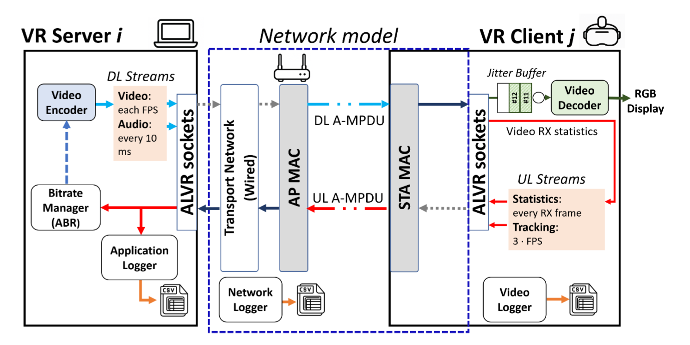
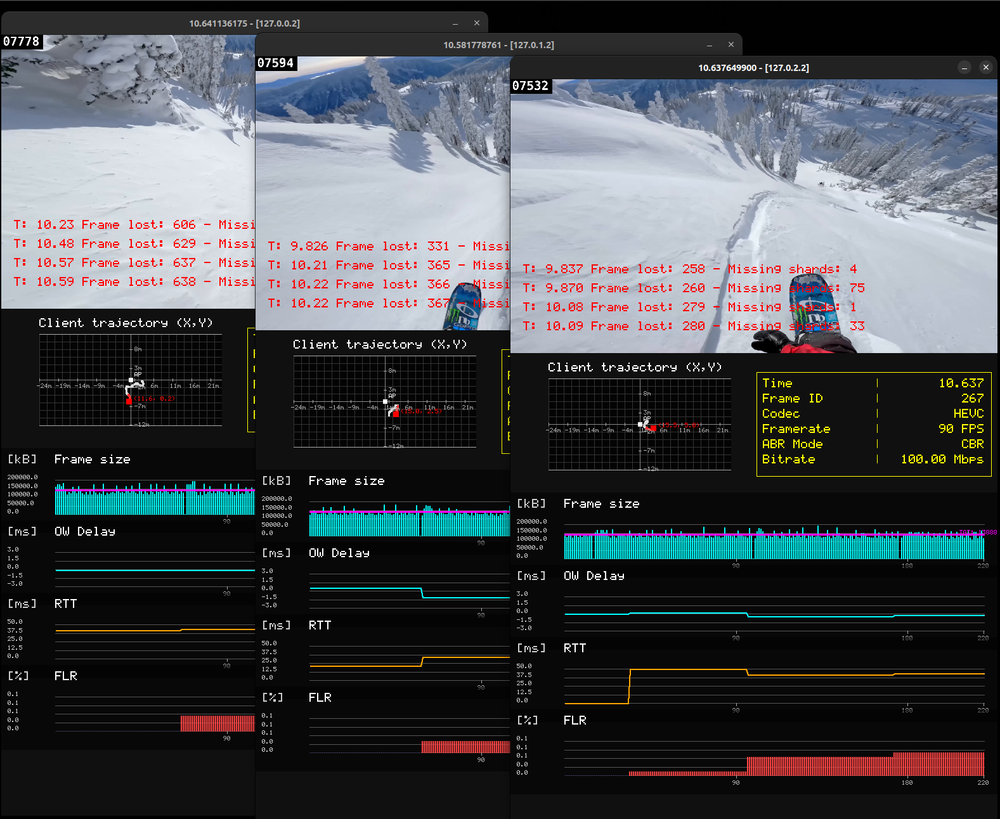

# SiESTA-VR: Simulation Environment for Streaming Applications in Virtual Reality

[](https://opensource.org/licenses/MIT)
[](https://www.rust-lang.org/)
[](https://en.wikipedia.org/wiki/IEEE_802.11be)

**SiESTA-VR** is a high-fidelity, discrete-event simulation framework designed to evaluate the stringent latency and throughput requirements of next-generation wireless networks. Built on a fork of the asynchronous [**NeXosim**](https://github.com/asynchronics/nexosim) library in Rust, it provides a robust environment for researching Cloud VR interactive streaming over **IEEE 802.11be (Wi-Fi 7)**.

---

## 🚀 Key Features

* **High-Fidelity VR Modeling:** Mimics the bidirectional traffic and logic of real Cloud VR sessions (e.g., ALVR), moving beyond generic traffic generators.
* **Native Wi-Fi 7 Support:** Incorporates core Wi-Fi features such as Multi-Link Operation (MLO) and Enhanced Distributed Channel Access (EDCA), with architecture in place for future OFDMA integration.
* **Advanced Codec Integration:** Supports real-time 4K resolution video encoding (60/90/120 FPS) utilizing HEVC and AV1 codecs, with a per-user GUI showing the decoded video and metrics. 
* **Lightweight Mode:** Execute fast simulations using pre-recorded CSV logs of video frame sizes mapped to specific codecs (HEVC/AV1), framerates (60/90/120 FPS), and CBR bitrates (5-100 Mbps).
* **ABR Benchmarking:** Provides a comprehensive suite of Adaptive Bitrate (ABR) algorithms to evaluate scalability and congestion impact on application-level QoS metrics.
* **HPC Parallel Execution Engine:** Tested on the [UPF HPC cluster](https://guiesbibtic.upf.edu/recerca/hpc/home) and a high-end laptop computer. Supports [GNU Parallel](https://www.gnu.org/software/parallel/) for rapid, large-scale data generation across multiple network scenarios. 

---

## 🏗️ Architecture & Pipeline

The simulator is designed to handle multiple $N_{XR}$ VR sessions concurrently with a synchronized simulation time reference across all devices in the network. It supports both static user positions and dynamic mobility (via random walk) with configurable distances to the Access Point (AP). The VR streaming simulated sessions follow the bidirectional pipeline illustrated below:



---

## 🛠️ Getting Started

### Prerequisites & Dependencies

To compute VMAF metrics and handle video transcoding recorded from simulations, this simulator requires:
* **Rust Toolchain**: (Latest stable release)
* **FFMPEG v7.1**: [Download here](https://ffmpeg.org/download.html)
* **libvmaf (Optional, for offline VMAF/SSIM evaluation)**: [GitHub Repository](https://github.com/Netflix/vmaf/tree/master/libvmaf)

### Asset Configuration

**1. Live Transcoding Mode (Video Assets):**
Ensure your video source files are located in the `video_samples_vmaf` folder. The simulation expects interpolated 4K videos formatted as `<video_filename>_<FPS>fps.mp4` (e.g., interpolated using FFmpeg `minterpolate`).
> *Note: Sample 4K/60FPS videos can be obtained from the [Blender Open Data platform](http://bbb3d.renderfarming.net/download.html). Running a specific FPS in the simulation requires a source video matching that framerate.*

**2. Lightweight Mode (CSV Logs):**
For faster execution without real-time transcoding, set `USE_FFMPEG_DEMO = False`. The simulator will read frame sizes from the `csv_framesizes` directory instead, using the naming convention `<codec>_<video_filename>_<FPS>fps.csv`.
> *Tip: Custom CSV logs can be generated from arbitrary video samples across specific FPS and bitrates by running the script in `examples/p_encode2csv.rs`:* `cargo run --release --example p_encode2csv`

---


## 📊 Simulation Outputs & Telemetry (CSV Logs)
The simulator has a debug feature when setting `DEBUG_PRINT_ENABLED = True`, where most components of a VR session at the lowest level produce events logging the simulation timestamp and information about the ongoing processes for each VR session, using macros for coloring the terminal output. Similar debugging features are found with `DEBUG_EDCA` and `DEBUG_MLO`, more focused on the respective mechanisms. If `SERIAL_EXECUTION=1` in the bash script, the entire output of a simulation is saved into an ANSI file named `out_log.ans`, which can be inspected for debugging purposes during or after a simulation. For speed, most debugging prints are disabled as the default. 

When `USE_FFMPEG_DEMO = True`, every simulated VR client generates a window with a Graphical User Interface (GUI) showing the decoded video and simulation parameters, user trajectory and a sliding window of QoS metrics. This is exemplified in the next figure, which shows the per-user GUIs of 3 CBR users streaming while performing a random walk:



For datalogging, upon execution of each simulated scenario the framework generates a uniquely named directory based on the specific input arguments to the simulation. Specifically, the lengthy folder scenario name creates a subfolder inside the `results_path_name` destination path, based on the following string: 
```rust
    let name_folder = format!(
        "sim_T{:.0}_D{:.1}_Br{:.1}Mbps_FPS{:.0}_Codec{codec_input_arg}_PL{:.1}_aggAMPDU={:.0}_NXR{:.0}_NBG{:.0}_BGLambda{:.0}_UL{:.0}_{suffix}_{video_filename}_Nclose{:.0}_dclose{:.1}_S{:.0}_GoP{:.0}_IR{:.0}_ABR{:.0}_nest{:.0}_obs{:.0}_reward{:.0}_{mlo_channel_config}_EDCAbe{:.0}_{}_SocketRx{}",
        stoptime, distance, initial_bitrate, fps_arg, pl_prob, packs_per_ampdu, n_xr, n_bg, rate_bps_bg_in ,is_ul_bg_traffic,  n_close, distance_close, seed, gop_size, intra_refresh, abr, nest_vr_choice, observation_type, reward_mode, edca_be, mlo_policy.to_string(), ALVR_ORIGINAL_SOCKETRX_BEHAVIOR,
    );
```

Inside these folders, granular CSV files capture dynamics bridging the 802.11be MAC layer all the way up to the VR application layer.

For a simulation configuring $N_{XR}$ total users, telemetry is divided per-user using an identifier ranging from `0` to `N_XR - 1` (e.g., `XR_stats_0.csv`, `XR_stats_1.csv`).

| Generated File | Description & Core Data Columns |
| :--- | :--- |
| **`QUEUE_stats.csv`** | **Global MAC-Layer Metrics:** Provides an event-by-event log of *every* MPDU traversing the simulation network. Logs include `packet_ID`, STA source and destination IDs, MAC `queue_size` during the transmission of the packet, transmission time (`T_s`), MAC queuing delay (`T_q`), aggregation size ( when classifying by `AMPDU_ID`), collisions (`is_collision`), contention windows (`CW_value`), Access Category (`EDCA_AC`), MAC retry counters (`backoff_retry_counter`), and which interface was utilized (`link_id` — crucial for MLO evaluation). |
| **`XR_stats_{id}.csv`** | **Application-Level VR Metrics:** Per-frame QoS telemetry evaluated directly at the VR client. Tracks variables vital to user QoE, including: `frame_size_bytes`, `server_fps`, `ow_delay_ms` (one-way delay), `rtt_ms` (Video Frame RTT), `frame_jitter_ms`, `instant_network_throughput_bps`, `decoder_jitterbuffer_level`, `rebuffering_events`, and frame/shard losses (`flr_sum_deadline`). |
| **`TRACKING_stats_{id}.csv`** | **Uplink Mobility Tracking:** Records the kinematics of the VR headset. Includes the high-frequency polling `timestamp`, the device coordinates (`pos_x`, `pos_y`, `pos_z`), and the generation `interarrival_ms` defining the uplink tracking data rate. |
| **`trace_emu_effects_{id}.csv`** | **Network Emulation Dynamics:** Traces the exact timing and parameters of the exogenous synthetic network effects (if any) applied to a user's connection pipeline. It tracks bandwidth limits (`bw_max_bps`), jitter variances (`jit_variance`), and forced `drop_probability`, specially useful for reproducibility when bandwidth effects are randomly spread over a simulation (e.g., when the `EMU_TEST_TYPE` setting is set to `"RANDOM"`).  


## 💻 Simulation Configuration & Execution

SiESTA-VR utilizes the `p_xrun.sh` bash script to manage execution. The script is heavily optimized for **SLURM-based High-Performance Computing (HPC)** environments but supports local execution (with minor warnings). It iterates over arrays of variables to automatically generate and simulate massive parameter sweep combinations, which can be serially executed or run in parallel over multiple nodes.

Before running, opening `p_xrun.sh` is recommended for adjusting the arrays and variables to design the experiment space. For a description of the main simulation parameters:

### 1. Wi-Fi & Network Topology Settings
| Variable | Description |
| :--- | :--- |
| `MLO_CONFIGS` | Regex-based Wi-Fi 7 mode selection (e.g., `"SLO80"` for Single Link 80MHz, `"MLO80-80"` for MLO with two 80MHz channels, `"MLO80-320"`, etc.). |
| `MLO_policies` | Cross-link scheduling policy: `0` (PrimaryFirst), `1` (Opportunistic), `2` (LyapunovBackpressure). Unused when const `STR_PLUS_MODE_MLO` is set to true. | 
| `EDCA_BE_MODE` | Set to `1` to force all traffic into the Best Effort (BE) Access Category, or `0` for default AC mapping. |
| `packs_per_ampdu` | Target number of MPDUs per aggregated A-MPDU transmission (e.g., `64`). |
| `distance_list` | Base distance (in meters) of users to the Access Point (e.g., `2.5`). |
| `num_close_users` / `distance_close_users` | Used to create heterogeneous spatial layouts by setting a specific number of users closer to the AP. |
| `RANDOMWALK_TEST` | If `1`, randomizes all VR user positions and applies a random walk mobility model (2 m/s in a 11.5m radius). |
| `PL` | MAC Packet Error Rate, applies (0-1) chance for each MPDU traveling in an A-MPDU to not be received and require retransmission. |
| `RANDOM_SEEDS` | List that determines the number of random seeds applied per scenario. |

### 2. VR Streaming & Video Parameters
| Variable | Description |
| :--- | :--- |
| `N_XR` | Number of concurrent VR user sessions in the simulation (e.g., `1` through `10`). |
| `CODEC_CHOICES` | Video codec selection: `"HEVC"`, `"AV1"`. |
| `video_samples` | The specific video sequence to use (e.g., `"snow_short"`). |
| `initial_bitrate_mbps` | Starting Constant Bit Rate (CBR) or initial target for ABR algorithms. |
| `fps_list` | Video frame rate (e.g., `60.0`, `90.0`, `120.0`). |
| `GoP_sizes` | Group of Pictures size (must be less than `T_ABR * FPS`). |
| `intrarefresh_choice` | Enables intra-refresh (`1`) for error resilience when `USE_FFMPEG_DEMO` is active. Overrides `GoP_sizes` if set to true. |

### 3. Adaptive Bitrate (ABR) Configuration
| Variable | Description |
| :--- | :--- |
| `ABR_ENABLED` | Selects the ABR algorithm: `0` (CBR), `1` (NeSt-VR), `2` (EveREst), `4` (GCC), `5` (NADA). |
| `T_ABR` | Interval (in seconds) between ABR updates or RL step actions (e.g., `1.0`). |
| `nest_profiles` | Specific configuration tuning profiles for the NeSt-VR algorithm. |

### 4. Background Traffic Settings
| Variable | Description |
| :--- | :--- |
| `N_BGs` | Number of active Background (BG) Stations sharing the medium with Poisson distributed traffic. |
| `rates_bps_BGtraffic` | The traffic rate (bps) generated by Poisson background STAs (e.g., `5000` to `500000`). |
| `IS_UL_BG` | Direction of BG traffic: `0` (Downlink), `1` (Uplink), `2` (Bidirectional). |
| `mean_length_BG` | Average packet payload length for background traffic (in bits). |
 
### 5. Emulated Network Effects
| Variable | Description |
| :--- | :--- |
| `EMU_TEST_TYPE` | Injects synthetic network anomalies: `"BW"` (Bandwidth limit), `"JI"` (Jitter), `"PL"` (Packet Loss), `"RANDOM"`, or `"STD"` (Standard/None). |

### Running the Simulator
A feature of how the repository has been structured (A fork of an earlier build of NeXosim, renaming the `examples` to `orig_examples` and using the folder for the networking engine of SiEsTam libraries and VMAF evaluation scripts), the simulator can be called via `cargo run --release --example XR_sim [<arg0><arg1>...]` but due to the amount of configuration parameters, we opt for iteration over lists of scenarios with a bash script.  
**On any standard computer with the required dependencies: **
Simply running the bash script with: 
```bash
./p_xrun.sh
```

**On an HPC Cluster (SLURM):**
Submit the job array using `sbatch`. The script utilizes weighted interleaving to balance heavy tasks (such as MLO simulations with many VR users) across computing nodes. Simulations involving 1-6 users are relatively fast, with the more complex scenarios the number of simulated events increases exponentially.

```bash
sbatch p_xrun.sh
```


### VMAF evaluation: 

After a simulation is finished, the frame IDs logged for each user on a simulated scenario folder can be passed through an offline evaluation script (`cargo run --release --example `), which passes synchronized frame pairs from the recorded simulation to parallel workers that compare decoded frames against the reference. We only consider VMAF in scenarios with no loss for our scenarios (due to VMAF not being originally thought for such type of Error Concealment artifacts), however frame IDs can be used for evaluation via slightly modifying the script, to 'lose' the frames which do no have a frame ID in the `XR_stats_0.csv` evaluated. The method used in the paper only considers a scenario with ideal conditions with a single user, and tests every scenario folder found inside the path set by the  `results_scenarios_folder` string in the main function. Running the script results in `VMAF_metrics_loss_0.csv` files being logged on each scenario folder, containing the per-frame VMAF and SSIM scores from the evaluation. It should be noted that VMAF is computationally expensive, and evaluation with this method can take multiple hours if the evaluated folder contains many scenarios or simulation times are long.  
